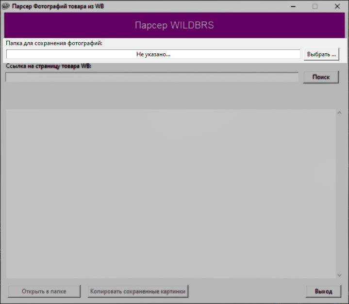
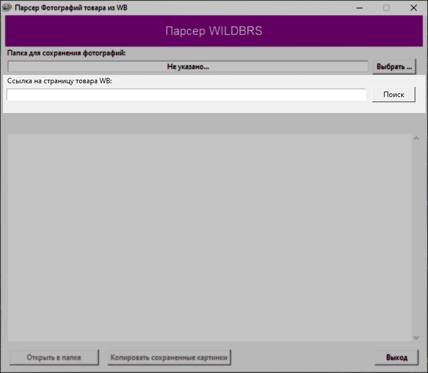

# Парсер информации о товаре со страниц товара WILDBERRIES

###### Сделано исключительно в образовательных целях!

  

### Десктоп приложение которое помогает быстро получать информацию о товаре из страницы товара Wildberries.
### Инструкция по использованию:

1) Скачать приложение последней [Версии](https://github.com/RuslanAl1mov/Photo_parser_WB/releases):

   

   Не обязательно качать фалы с Source Code (Файл с исходным кодом). Достаточно скачать уже собранное приложение "WB Parser VX-X.exe", где X-X - версия приложения.

2) Открыть приложение:

      

    При открытии приложения, Антивирус установленный на вашей ОС, может выдать предупреждение о том, что найдено небезопасное ПО и предложит его удалить или же удалит его без предупреждения (зависит от настроект антивируса). Это происходит по тому что программа не является скомпилированной. Она просто собрана в один общий пакет со всеми зависимостями. Так как программа не скомпелирована, она содержит в себе файлы с необходимыми для ее работы скриптами(файлы с кодом), на которые и реагируют антивирусы. Эта проблема будет решена с выпуском новых версий программы.

3) Выберите папку, куда будут скачиваться фотографии:

   

   В эту папку после окончания парсинга страницы, будут сохраняться все фото товара, имеющиеся на странице товара.  
   
   Внимание!
   * Нужно учитывать, что при парсинге новой страницы товара, все фото с прошлого парсинга удаляются!
   
   Выбираемая вами папка не обязательно должна быть пустой. Парсер понимает какие фотогрфии были скачаны в прошлый раз и удаляет только те файлы, который качал он сам. Для безопасности ваших личных файлов внутри выбираемой вами папки, не переименовывайет их на названия фотографий, которые качает парсер.
   
4) Вставьте ссылку на страницу товара, которую необходимо спарсить:

   
