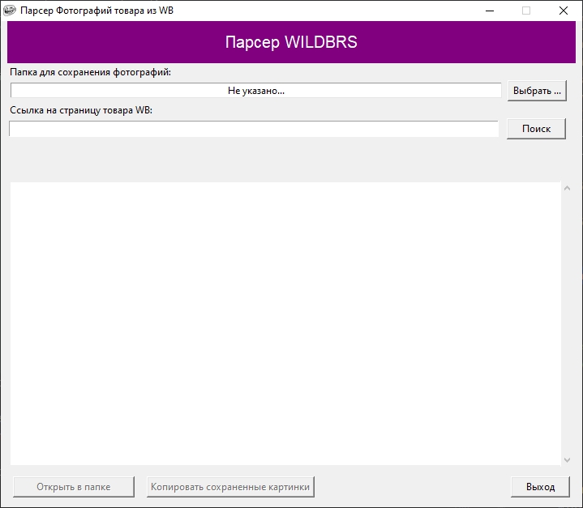

# Парсер информации о товаре со страниц товара WILDBERRIES

###### Сделано исключительно в образовательных целях!

  

### Десктоп приложение которое помогает быстро получать информацию о товаре из страницы товара Wildberries.
### Инструкция по использованию:

1) Скачать приложение последней [Версии](https://github.com/RuslanAl1mov/Photo_parser_WB/releases):

   

   Не обязательно качать фалы с Source Code (Файл с исходным кодом). Достаточно скачать уже собранное прилоежение "WB Parser VX-X.exe", где X-X - версия приложения.

2) Открыть приложение:

      

    При открытии приложения, Антивирус установленный на вашей ОС, может выдать предупрдение о том, что найдено небезопасное ПО и предложит его удалить или же удалит его без предупреждения (зависит от настроект антивируса).
